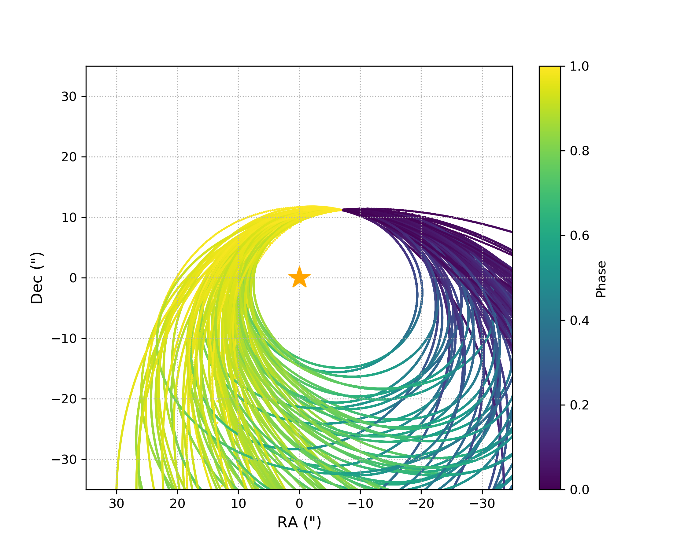
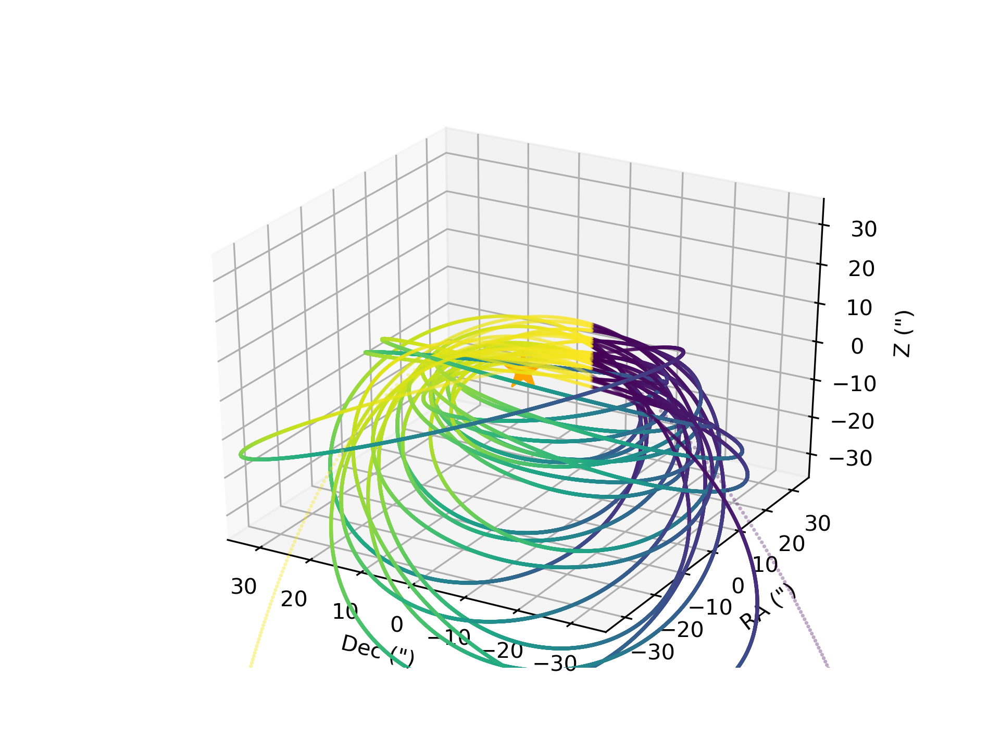

# LOFTI for time-series astrometry. 
# Deprecated: if you're looking for the Gaia binary orbit fitter, go here: [https://github.com/logan-pearce/lofti_gaiaDR2](https://github.com/logan-pearce/lofti_gaiaDR2)

#### Or: Logan's OFTI

This is my implementation of Orbits for the Impatient developed by Blunt et.al. 2017 (http://iopscience.iop.org/article/10.3847/1538-3881/aa6930/pdf).  It was developed independantly from that group's efforts based on this paper. 

This repository contains examples of two different versions of LOFTI.  The first, in the "Using_Astrometry" directory, is my version of the OFTI methodology using multiple astrometry observations to fit one orbiting body around a host star.  The script here is the relative astrometry for the system GSC 6214-210, which is reported in Pearce et. al. 2019 (Arxiv: https://arxiv.org/pdf/1812.08860.pdf Publisher: https://iopscience.iop.org/article/10.3847/1538-3881/aafacb/pdf), and used to generate the orbit plots in that paper.

Second is a version of LOFTI that fits in 6-d phasespace, one observation of RA/Dec position, RA/Dec proper motions, and radial velocity, located in the "Using_Position_Vector" directory.  It is optimal for fitting wide binaries in Gaia, for example.  The document Solving_for_orbital_elements_given_velocities.pdf outlines the math and the methodology used in the fit.  The script included in this repository is for the wide binary system of GK and GI Tau, which doesn't include radial velocity, so both Z position and Zdot are unconstrained in the fit.  

The orbits from the fit of GK - GI Tau

The script "lofti_plots.py" produces stats for each parameter, histograms of the distribution of each parameter, histograms of the distribution of positions, velocities, and accelerations in all 3 dimensions for each orbit in the posterior, a selection of 100 orbits plotted in XY, XZ, YZ planes, and a selection of 20 orbits plotted in 3d.

## Author
The project was completed by Logan Pearce (http://www.loganpearcescience.com), under the mentorship of Dr Adam Kraus at the University of Texas at Austin.

## Acknowledgments

This work has made use of data from the European Space Agency (ESA) mission Gaia (https://www.cosmos.esa.int/gaia), processed by the Gaia Data Processing and Analysis Consortium (DPAC, https://www.cosmos.esa.int/web/gaia/dpac/consortium). Funding for the DPAC has been provided by national institutions, in particular the institutions participating in the Gaia Multilateral Agreement.

Software:
numpy, astropy
