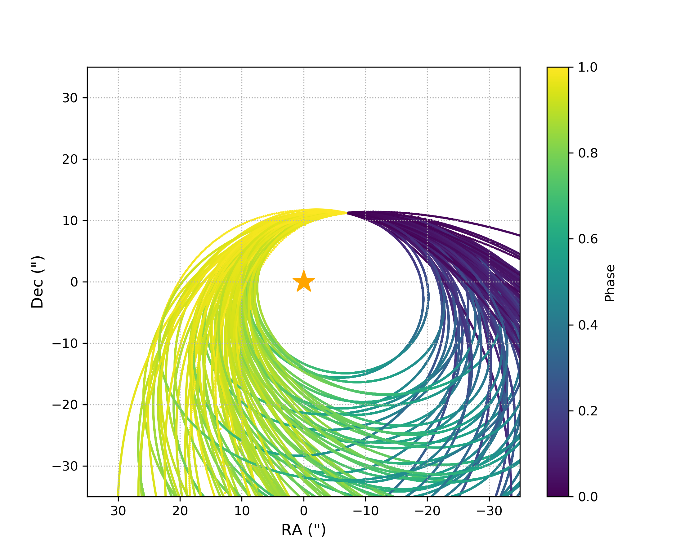
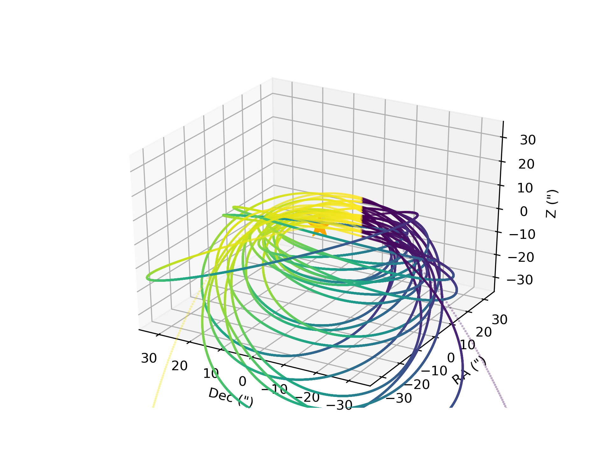

# LOFTI
#### Or: Logan's OFTI
This is my implementation of Orbits for the Impatient developed by Blunt et.al. 2017 (http://iopscience.iop.org/article/10.3847/1538-3881/aa6930/pdf).  It was developed independantly from that group's efforts based on this paper. 

This is the version of LOFTI that fits in 6-d phasespace, one observation of RA/Dec position, RA/Dec proper motions, and radial velocity.  It is optimal for fitting wide binaries in Gaia, for example.  

Repository contents:

Solving_for_orbital_elements_given_velocities.pdf outlines the math and the methodology used in the fit.  
lofti_phasespace_GKTau_mpi.py the script for fitting Gaia astrometry to the wide binary pair GK Tau and GI Tau.
lofti_plot.py script which generates the plots and statistical results of the fit.

The script included in this repository is for the wide binary system of GK and GI Tau, which doesn't include radial velocity, so both Z position and Zdot are unconstrained in the fit.  

The orbits from the fit of GK - GI Tau

## Author
The project was completed by Logan Pearce (http://www.loganpearcescience.com), under the mentorship of Dr Adam Kraus at the University of Texas at Austin.

## Acknowledgments

This work has made use of data from the European Space Agency (ESA) mission Gaia (https://www.cosmos.esa.int/gaia), processed by the Gaia Data Processing and Analysis Consortium (DPAC, https://www.cosmos.esa.int/web/gaia/dpac/consortium). Funding for the DPAC has been provided by national institutions, in particular the institutions participating in the Gaia Multilateral Agreement.

Software:
numpy, astropy, MySQL Connector/Python
